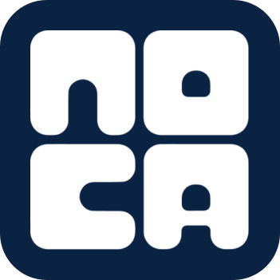
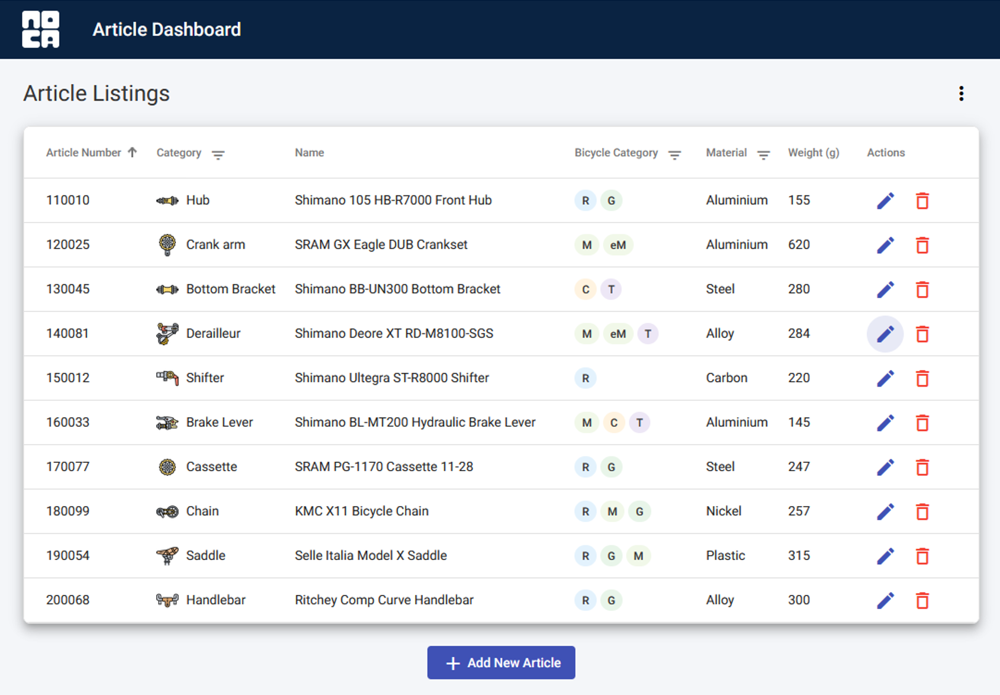

# Article Management Dashboard

<p align="center">
  
</p>
<p align="center">
  A full-stack web application for managing bicycle component articles, built with Angular and .NET 6.
</p>

---

## Live Demo

* **Frontend (Netlify):** [https://article-dashboard-noca.netlify.app/](https://article-dashboard-noca.netlify.app/)
* **Backend API (Render):** [https://article-dashboard-v2.onrender.com/swagger](https://article-dashboard-v2.onrender.com/swagger)

<br>
<p>
  
</p>

---

## Features

This dashboard provides a complete solution for an internal editorial team to manage product specifications.

#### Frontend (Angular 11 & Angular Material)
- **Dynamic Data Table:** Displays a list of all articles with key information.
- **Advanced Sorting:** Sort the article list by `Article Number`, `Category`, `Name` or `Net Weight (g)`.
- **Integrated Filtering:**
    - Filter by `Article Category` (single select).
    - Filter by `Bicycle Category` (multi-select).
    - Filter by `Material` (single select).
    - Filter controls are integrated directly into the table headers for a clean UI.
- **CRUD Operations in Modals:**
    - **Create & Edit:** Add new articles or edit existing ones in a responsive dialog modal.
    - **Delete:** A custom confirmation dialog prevents accidental deletions.
- **User-Friendly Form:**
    - The entry form uses a vertical layout for clarity.
    - **Dynamic Icons:** A visual icon at the top of the form changes based on the selected article category.
    - **Read-Only Article Number:** A unique article number is automatically proposed and is not editable.
- **Data Export:** Export the current view of the article table as a `.csv` or `.json` file.
- **Visual Feedback:**
    - Form fields provide clear validation feedback for required fields and character limits.

#### Backend (.NET 6)
- **RESTful API:** A complete set of endpoints for all CRUD (Create, Read, Update, Delete) operations.
- **Database:** Uses **SQLite** with **Entity Framework Core** for persistent data storage.
- **Automated Migrations:** The database schema is automatically created and updated on application startup.
- **Data Seeding:** The database is pre-populated with a default set of articles.
- **API Documentation (Swagger):** The API is fully documented and interactive via Swagger UI.
- **Deployment Ready:** Configured for containerized deployment using Docker.

---

## Technology Stack

| Area      | Technology                               |
| :-------- | :--------------------------------------- |
| **Frontend** | Angular 11, TypeScript, Angular Material, RxJS |
| **Backend** | .NET 6, ASP.NET Core Web API, C#         |
| **Database** | SQLite, Entity Framework Core 6          |
| **Deployment**| Netlify (Frontend), Render (Backend), Docker |

---

## How to Run Locally

### Prerequisites
- [.NET 6 SDK](https://dotnet.microsoft.com/en-us/download/dotnet/6.0)
- [Node.js](https://nodejs.org/) (v14.15.4 or compatible)
- [Angular CLI](https://angular.io/cli) (v11.0.6)

### 1. Clone the Repository
```bash
git clone <your-repository-url>
cd article-dashboard
2. Run the BackendNavigate to the backend directory:cd backend
The first time you run the project, the database needs to be created. The application is configured to do this automatically.Run the application:dotnet run
The backend API will now be running, typically at http://localhost:5193. You can view the Swagger documentation at http://localhost:5193/swagger.3. Run the FrontendOpen a new terminal and navigate to the frontend directory:cd frontend
Install the necessary packages:npm install
Run the application:ng serve
The frontend will be available at http://localhost:4200 and will connect to your local backend.Project StructureThis project is a monorepo containing two separate applications:/article-dashboard/
├── backend/          # .NET 6 Web API Project
│   ├── Controllers/
│   ├── DTOs/
│   ├── Data/
│   ├── Migrations/
│   ├── Dockerfile    # Instructions for deployment
│   └── ...
├── frontend/         # Angular 11 Project
│   ├── src/
│   │   ├── app/
│   │   │   ├── components/
│   │   │   ├── services/
│   │   │   └── ...
│   │   └── assets/   # Contains logo and part icons
│   └── ...
├── .gitignore
└── README.md
